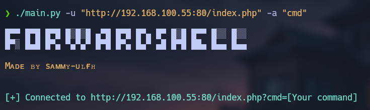
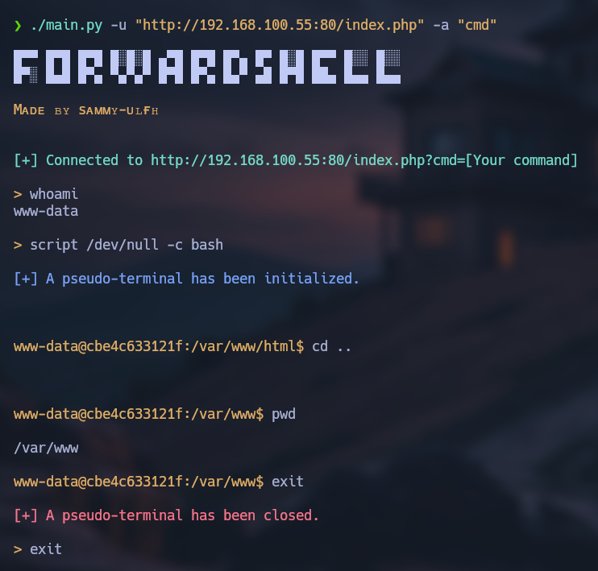

# forward_shell

<p align="center">
    
</p>

**Forward Shell** is a tool for Command Execution via Malicious File in a web server. This tool is an enhancement of a Web Shell, allowing the execution of pseudo-terminals and providing a more interactive expirience.

<p align="center">
    
</p>

## Table of contents

- [First stepts](#what-do-i-need-to-run-it)
- [Neccesarry steps before running](#how-does-it-work)
- [How to run it](#how-do-i-use-it)

## What do I need to run it?

1. First, clone the repository:

    ```git
    git clone https://github.com/sammy-ulfh/forward_shell.git
    ```

2. Then, navigate to the **forward_shell/script** directory.

3. Next, install required libraries using pip:

    ```pip3
    pip3 install -r requirements.txt
    ```

## How does it work?

This Forward Shell tool provides us with a better and more interactive experience for command injection in a web server (web shell) by passing commands through a specific argument, which the server executes as a command.

How it works:<br/>

<p align="center">
    
</p>


## How do I use it?

- **Main URL:**
    Use the -u / --url argument to specify the URL of the web server.
    Example: -u 'http://192.168.100.1:80/index.php'<br/>

- **Argument for command execution:**
    Use the -a / --argument argument to specify the parameter that communicates the command to execute on the server.
    Example: -a 'cmd'<br/>

